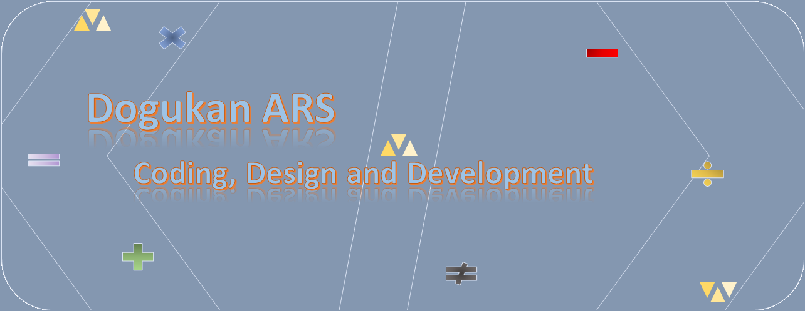

> # Hi everyone 👋
## **`Metallurgical and Materials Engineer (who wants to change his department as Software Developer or Programmer)`**

I'm Dogukan from Turkey. I have begun coding since August. So I am nearly fresher ✌️ However, I'm a hard worker, eager, and curious person. Therefore I'm open to learning something new in my life. Especially to learn how to convert things into code. Because I enjoy when I am writing code or solving problems with code. I like to think about ways of solutions. Sometimes I can't find it and lose myself in creating new solutions, but that process feels fantastic.

## Skills & Experience
- 💻 Currently working on HTML, CSS and Bootstrap with myself, not in any company (mini projects for my improvement).
- 🌱 I’m currently learning JavaScript and Java.
- 👯 I’m looking to collaborate on Frontend, Backend or Game Development.
- 🎹 🎸 🎵  I like to play some enstrument such as piano, guitar and flute.

   
 
 

 

